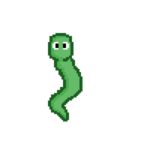
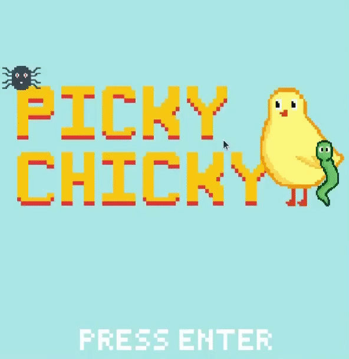

Welcome to ***Picky Chicky***! In this game, you will help Chicky - who is quite picky - only obtain the worm and avoid the spider. Catching each worm will get you a point, but beware: catching a single spider will end the game, as you have disapppointed Chicky.

# Unique Features

The game consists of 3 characters: Chicky, Wormy, and Spidey. Your objective is to make sure Chicky collides only with the Wormy, the falling worm, while avoiding Spidey, the falling spider. Each worm collected increases your score by 1 point. If you collide with a spider, you lose the game and the game comes to an end, with your final score displayed.

  

## Gameboard

From the three characters to the start, game, and end screens, all game components have been custom-made with pixel art graphics. With each game run, the places from which Wormy and Spidey fall are randomized, so you can never expect where they'll be falling from.

  

## Navigation

By using the left and right arrows, you can help Chicky move around to dodge the spiders and obtain the worms to get as many points as possible!

## Falling items

During gameplay, you will see Wormy and Spidey falling from the top of the screen for Chicky to either collect or avoid. And what's the fun part, you ask? They fall faster and faster by the *second*, so put your reflexes to the test and avoid Spidey as best as you can!

## Putting it all together...

# Installation 

To play *Picky Chicky*, you will need to installation the Pygame library in Python. You can install Python [here](https://www.python.org/downloads/) and Pygame [here](https://www.pygame.org/wiki/GettingStarted). Next, download the files in the Picky Chicky Game repository from Github [here](https://github.com/olincollege/Picky-Chicky-Game/), and navigate to the Picky Chicky folder in the terminal. Finally, the following code in your command line:

`python Picky_Chicky_game.py`

Now, you should see a pop-up of the game window. Enjoy your play!

## See our Github page for more!

[https://github.com/olincollege/Picky-Chicky-Game/](https://github.com/olincollege/Picky-Chicky-Game/)

# Creators

[**Sreenidhi Chalimadugu**](https://www.linkedin.com/in/sreenidhi-chalimadugu/)

Olin College of Engineering, 2023

Electrical and Computer Engineer

[**Kei Chua**](https://www.linkedin.com/in/kei-chua-3a7a96199/)

Olin College of Engineering, 2023

Mechanical Engineer

# Resources

To help develop this game, we took inspiration from the code in this Pygame tutorial from CodersLegacy, found [here](https://coderslegacy.com/python/python-pygame-tutorial/).
